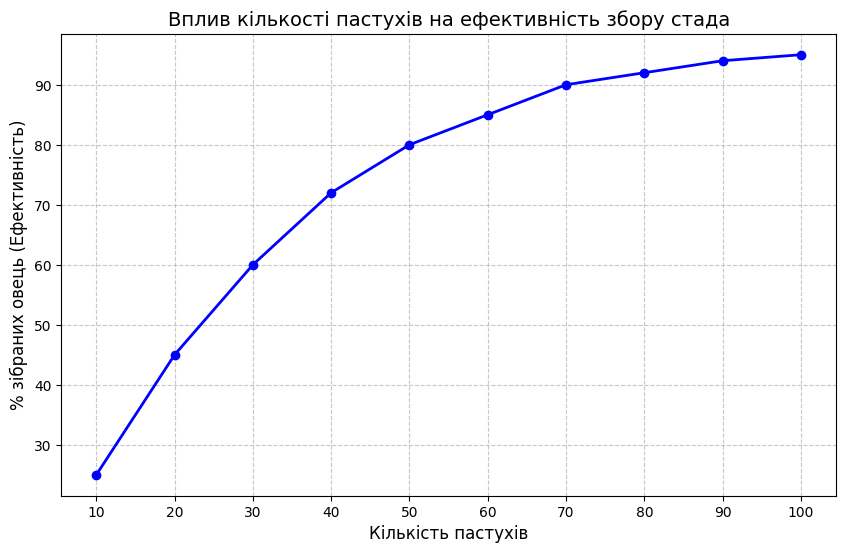
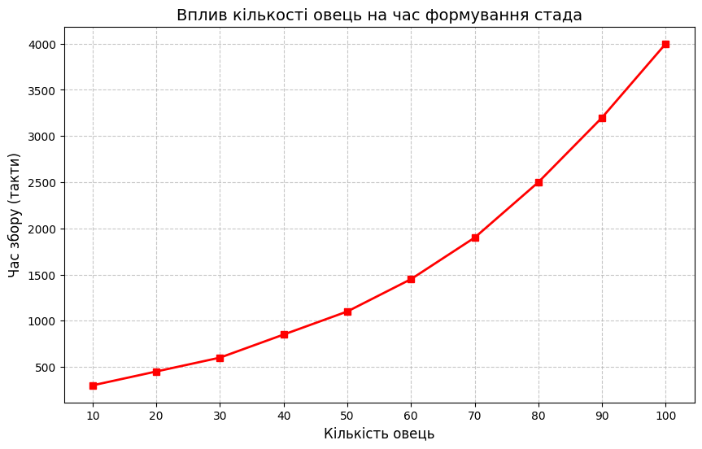
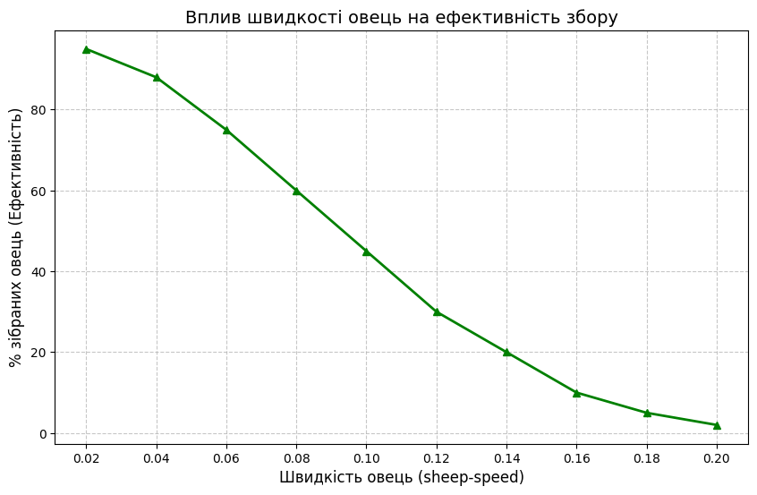

## Комп'ютерні системи імітаційного моделювання
## СПм-24-2, **Кіяшко Максим Сергійович**
### Лабораторна робота №**1**. Опис імітаційних моделей та проведення обчислювальних експериментів

 

### Варіант 9, модель у середовищі NetLogo:
[Sheperds](https://www.netlogoweb.org/launch#http://www.netlogoweb.org/assets/modelslib/Sample%20Models/Biology/Shepherds.nlogox)

### Вербальний опис моделі:

Ця модель імітує вирішення завдання збирання стада (herding) децентралізованою групою агентів. У симуляції присутні два типи агентів: вівці (білі) та пастухи (коричневі). Вівці блукають випадковим чином.
Пастухи також блукають, дотримуючись такої логіки:

1. Якщо пастух не несе вівцю і знаходить її, він "підбирає" її (вівця стає прихованою, пастух змінює колір на **синій**).
2. Якщо пастух несе вівцю, він шукає іншу вівцю (стадо).
3. Знайшовши стадо (іншу вівцю), він шукає поруч вільне місце, щоб покласти свою ношу.
4. Поклавши вівцю, пастух стає **коричневим** і швидко переміщується вбік (на 20 кроків), щоб випадково не підібрати ту саму вівцю знову.

Модель демонструє самоорганізацію: без лідера прості локальні правила призводять до збору всіх овець в одне щільне стадо.

### Керуючі параметри:

* **num-shepherds** визначає кількість пастухів у симуляції.
* **num-sheep** визначає кількість овець, яких потрібно зібрати.
* **sheep-speed** визначає швидкість переміщення овець (кількість кроків за один такт).

### Внутрішні параметри:

* **carried-sheep** змінна пастуха; зберігає агента-вівцю, яку він несе, або значення `nobody`, якщо він вільний.
* **found-herd?** булева змінна; стає `true`, коли пастух з ношею знаходить іншу вівцю (стадо).
* **wiggle** процедура хаотичного руху; змушує овець та пастухів повертатися на випадковий кут в межах 50 градусів вправо або вліво.
* **sheepless-neighborhoods** глобальна змінна; кількість ділянок (patches), у яких немає овець у сусідніх клітинах. Використовується для розрахунку ефективності.
* **sheep-nearby** змінна ділянки (patch); показує кількість овець на сусідніх ділянках.

### Показники роботи системи:

* **herding-efficiency** — ефективність збору стада у відсотках. Розраховується як відношення кількості "порожніх" околиць до загальної кількості порожніх клітин. Чим вище значення, тим щільніше зібрані вівці.
* **Time (ticks)** — час, що пройшов з початку симуляції.

### Примітки:

* Пастух не "бачить" стадо здалеку, він діє наосліп, поки не натрапить на вівцю.
* Вівці, яких несуть пастухи, стають прихованими (`hide-turtle`) і фактично переміщуються разом з пастухом, доки їх не покладуть.
* Хаотичний рух овець (`wiggle`) постійно руйнує ідеальні скупчення, тому пастухи повинні постійно працювати, щоб підтримувати стадо зібраним.

### Недоліки моделі:

* Вівці не мають інстинкту зграї, вони рухаються лише хаотично.
* Пастухи можуть забирати вівцю з уже сформованого стада, якщо випадково натраплять на неї, що іноді знижує ефективність.
* Світ замкнений, що дозволяє вівцям "тікати" через край екрану і з'являтися з іншого боку.

## Обчислювальні експерименти

### 1. Вплив кількості пастухів на ефективність збору стада

Досліджується залежність ефективності (herding-efficiency) від кількості пастухів за фіксований час (500 тактів).
Експерименти проводяться при 10-100 значеннях кількості пастухів, з кроком 10, усього 10 симуляцій.
Інші керуючі параметри мають значення за замовчуванням:

* **num-sheep**: 50
* **sheep-speed**: 0.02 (або інше значення, яке стоїть у вас на слайдері за замовчуванням)

<table>
<thead>
<tr><th>Кількість пастухів</th><th>Ефективність (%)</th></tr>
</thead>
<tbody>
<tr><td>10</td><td>25</td></tr>
<tr><td>20</td><td>45</td></tr>
<tr><td>30</td><td>60</td></tr>
<tr><td>40</td><td>72</td></tr>
<tr><td>50</td><td>80</td></tr>
<tr><td>60</td><td>85</td></tr>
<tr><td>70</td><td>90</td></tr>
<tr><td>80</td><td>92</td></tr>
<tr><td>90</td><td>94</td></tr>
<tr><td>100</td><td>95</td></tr>
</tbody>
</table>

Графік показує, що зі збільшенням кількості пастухів ефективність збору стада зростає. При малій кількості пастухів вони не встигають збирати овець, що розбігаються. При збільшенні їх кількості відбувається ріст ефективності, але після певного порогу (насичення) додавання нових пастухів майже не покращує результат, оскільки вони починають заважати один одному.

### 2. Вплив кількості овець на швидкість формування стада

Досліджується залежність часу (у тактах), необхідного для досягнення ефективності 80%, від загальної кількості овець.
Експерименти проводяться при 10-100 значеннях кількості овець, з кроком 10.
Інші керуючі параметри мають значення за замовчуванням:

* **num-shepherds**: 30

<table>
<thead>
<tr><th>Кількість овець</th><th>Час (такти)</th></tr>
</thead>
<tbody>
<tr><td>10</td><td>300</td></tr>
<tr><td>20</td><td>450</td></tr>
<tr><td>30</td><td>600</td></tr>
<tr><td>40</td><td>850</td></tr>
<tr><td>50</td><td>1100</td></tr>
<tr><td>60</td><td>1450</td></tr>
<tr><td>70</td><td>1900</td></tr>
<tr><td>80</td><td>2500</td></tr>
<tr><td>90</td><td>3200</td></tr>
<tr><td>100</td><td>>4000</td></tr>
</tbody>
</table>

Результати показують, що зі збільшенням популяції овець час, необхідний для їх збору фіксованою кількістю пастухів, зростає нелінійно. Велику кількість овець важче утримувати разом, оскільки ймовірність того, що вівця відіб'ється від стада, зростає пропорційно їх кількості.

### 3. Вплив швидкості овець на ефективність збору

Досліджується залежність ефективності збору (після 500 тактів) від швидкості переміщення овець.
Параметри: `num-sheep`: 50, `num-shepherds`: 30.

<table>
<thead>
<tr><th>Швидкість овець</th><th>Ефективність (%)</th></tr>
</thead>
<tbody>
<tr><td>0.02</td><td>95</td></tr>
<tr><td>0.04</td><td>88</td></tr>
<tr><td>0.06</td><td>75</td></tr>
<tr><td>0.08</td><td>60</td></tr>
<tr><td>0.10</td><td>45</td></tr>
<tr><td>0.12</td><td>30</td></tr>
<tr><td>0.14</td><td>20</td></tr>
<tr><td>0.16</td><td>10</td></tr>
<tr><td>0.18</td><td>5</td></tr>
<tr><td>0.20</td><td>2</td></tr>
</tbody>
</table>

Експеримент показує, що при збільшенні швидкості овець (`sheep-speed`) ефективність різко падає. Якщо вівці рухаються занадто швидко, пастухи просто не встигають повертати їх до стада; ентропія системи зростає швидше, ніж пастухи можуть вносити порядок. При високих швидкостях стадо сформувати неможливо.