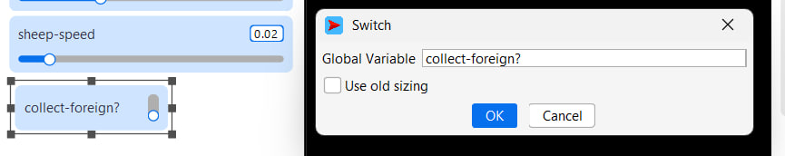
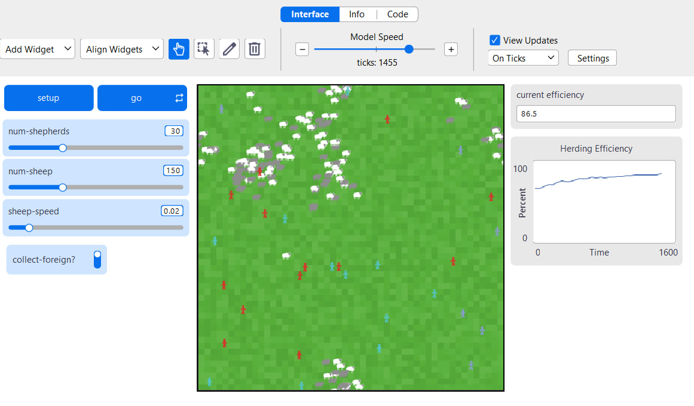
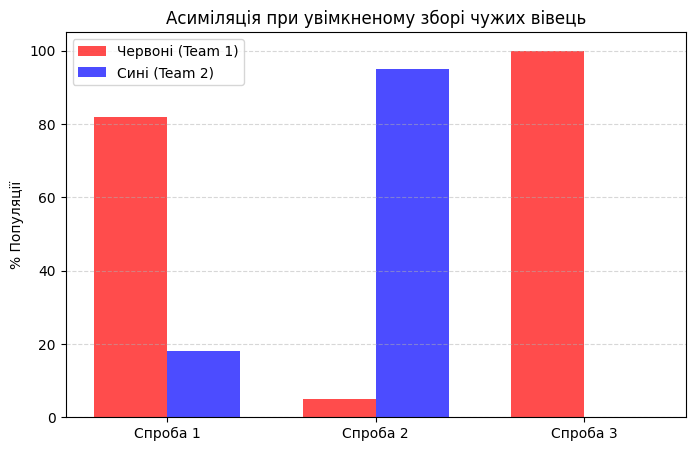

## Комп'ютерні системи імітаційного моделювання
## СПм-24-2, **Кіяшко Максим Сергійович**
### Лабораторна робота №**2**. Редагування імітаційних моделей у середовищі NetLogo

<br>

### Варіант 9, модель у середовищі NetLogo:
[Sheperds](https://www.netlogoweb.org/launch#http://www.netlogoweb.org/assets/modelslib/Sample%20Models/Biology/Shepherds.nlogox)

Поділити вівець на два різних стада, відповідно і пастухів на дві різні організації. Пастухи повинні збирати тільки "своїх" вівець. Додати відключаєму можливість збирати "чужих" вівець, які після потрапляння до нового стада змінюють свою приналежність.

### Внесені зміни у вихідну логіку моделі, за варіантом:

**Поділ агентів на дві команди та логіка "свій-чужий"**

Додано змінну `team` для овець та пастухів. При створенні світу агентам випадковим чином присвоюється команда 1 (червоні) або команда 2 (сині).
Пастухи тепер перевіряють приналежність вівці перед тим, як її підібрати.
Змінено процедуру **search-for-sheep**:

<pre>
to search-for-sheep
;; Пастух шукає вівцю на цьому патчі, яку не сховано
let potential-sheep one-of sheep-here with [not hidden?]

if (potential-sheep != nobody) [
;; Перевірка: чи вівця "своя", або чи увімкнено режим збору чужих
if ([team] of potential-sheep = team) or collect-foreign? [
set carried-sheep potential-sheep
ask carried-sheep [
hide-turtle
]
set color blue ;; колір "зайнятого" пастуха
fd 1
]
]
end
</pre>

**Зміна приналежності "чужих" вівець (Асиміляція)**

Реалізовано механізм зміни команди вівці. Якщо пастух підібрав "чужу" вівцю (при увімкненому перемикачі `collect-foreign?`), то в момент, коли він її кладе у стадо, вона змінює свій колір та команду на команду пастуха.
Змінено процедуру **find-empty-spot**:

<pre>
to find-empty-spot
if all? sheep-here [hidden?] [
ask carried-sheep [
show-turtle
;; АСИМІЛЯЦІЯ: Вівця стає частиною команди пастуха
set team [team] of myself
set color [color] of myself - 2 ;; трохи світліший від пастуха
]
;; Повернення початкового кольору пастуха залежно від команди
ifelse team = 1 [ set color red ] [ set color cyan ]

```
set carried-sheep nobody
set found-herd? false
rt random 360
fd 20

```

]
end
</pre>
**Інтерфейс**
Додано перемикач (Switch) `collect-foreign?` на панель керування, який дозволяє вмикати або вимикати можливість пастухів красти чужих вівець.



### Внесені зміни у вихідну логіку моделі, на власний розсуд:

**Додано параметр "Втома" (Fatigue) для овець**
Щоб зробити поведінку овець більш реалістичною, додано параметр енергії. Вівці не можуть бігати вічно. Кожен рух забирає енергію. Коли енергія падає до нуля, вівця мусить "відпочивати" (стояти на місці) певну кількість тактів, доки енергія не відновиться. Це дозволяє стаду бути більш стабільним, оскільки втомлені вівці не розбігаються.

<pre>
to move-sheep
;; Якщо енергія є - рухаємось і витрачаємо її
ifelse energy > 0 [
wiggle
fd sheep-speed
set energy energy - 1
]
;; Якщо енергії немає - відпочиваємо (відновлюємось)
[
set energy energy + 2
if energy > 50 [ set energy 50 ] ;; Максимальний запас
]
end
</pre>




## Обчислювальні експерименти

### 1. Вплив дозволу на збір "чужих" вівець на однорідність популяції

Досліджується, як можливість збирати чужих вівець впливає на кінцевий склад стада через 2000 тактів.
Початкові умови: 50 червоних і 50 синіх овець.
Якщо `collect-foreign?` = **Off**, очікується два окремих стада.
Якщо `collect-foreign?` = **On**, очікується процес асиміляції (переважання однієї команди).

Інші параметри: `num-sheep`: 100, `num-shepherds`: 30.

<table>
<thead>
<tr><th>Режим (collect-foreign?)</th><th>% Червоних</th><th>% Синіх</th><th>Результат</th></tr>
</thead>
<tbody>
<tr><td>OFF (Заборонено)</td><td>50%</td><td>50%</td><td>Два стабільних окремих стада різних кольорів.</td></tr>
<tr><td>ON (Дозволено) - Спроба 1</td><td>82%</td><td>18%</td><td>Червоні майже поглинули синіх.</td></tr>
<tr><td>ON (Дозволено) - Спроба 2</td><td>5%</td><td>95%</td><td>Сині повністю домінують.</td></tr>
<tr><td>ON (Дозволено) - Спроба 3</td><td>100%</td><td>0%</td><td>Повна асиміляція (моно-стадо).</td></tr>
</tbody>
</table>



**Висновки:**
При вимкненому параметрі `collect-foreign?` система прагне до рівноваги двох окремих кластерів. При увімкненні цього параметру система стає нестабільною: одна з популяцій випадковим чином отримує перевагу (наприклад, червоні пастухи швидше знаходять синіх вівець), що призводить до ланцюгової реакції "захоплення" та повної асиміляції меншості.