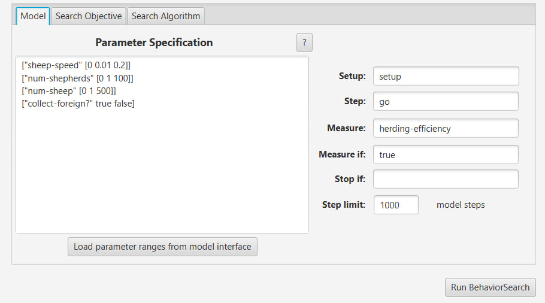
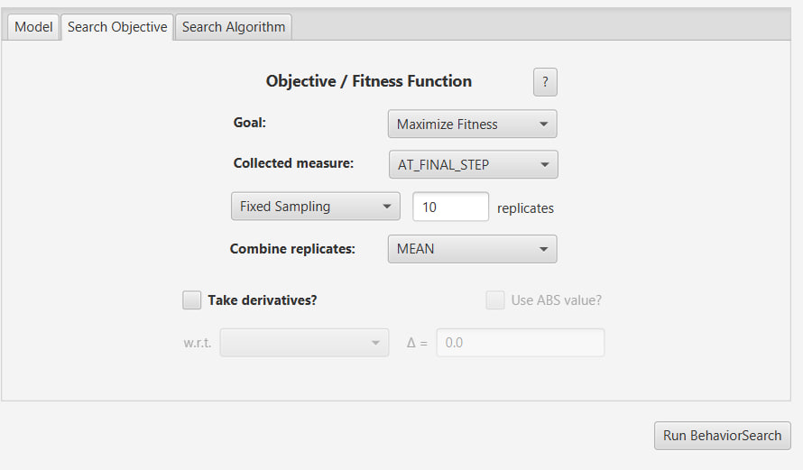
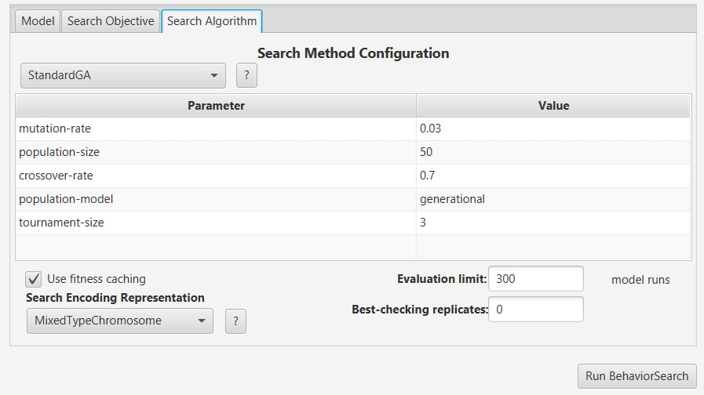
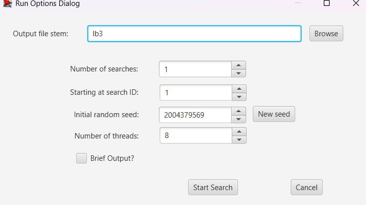
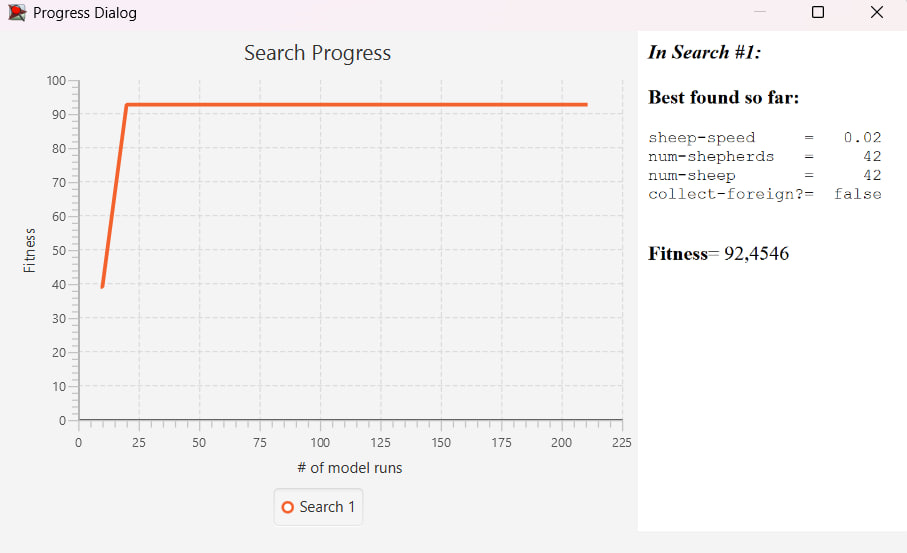
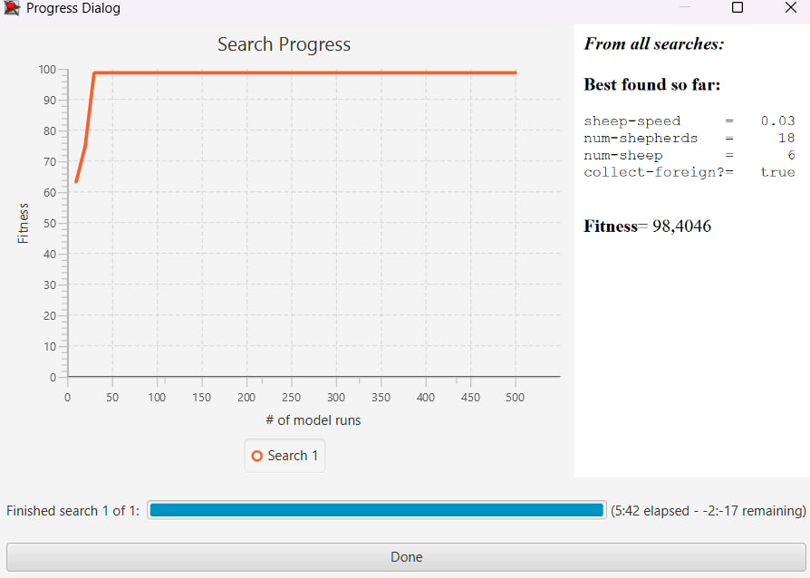

## Комп'ютерні системи імітаційного моделювання
## СПм-24-2, **Кіяшко Максим Сергійович**
### Лабораторна робота №**3**. Використання засобів обчислювального интелекту для оптимізації імітаційних моделей

 

### Варіант 9, модель у середовищі NetLogo:
[Sheperds](https://www.netlogoweb.org/launch#http://www.netlogoweb.org/assets/modelslib/Sample%20Models/Biology/Shepherds.nlogox)

 

### Вербальний опис моделі:

Ця модель імітує вирішення завдання збирання стада (herding) децентралізованою групою агентів. У симуляції присутні два типи агентів: вівці (білі) та пастухи (коричневі). Вівці блукають випадковим чином.
Пастухи також блукають, дотримуючись такої логіки:

1. Якщо пастух не несе вівцю і знаходить її, він "підбирає" її (вівця стає прихованою, пастух змінює колір на **синій**).
2. Якщо пастух несе вівцю, він шукає іншу вівцю (стадо).
3. Знайшовши стадо (іншу вівцю), він шукає поруч вільне місце, щоб покласти свою ношу.
4. Поклавши вівцю, пастух стає **коричневим** і швидко переміщується вбік (на 20 кроків), щоб випадково не підібрати ту саму вівцю знову.

Модель демонструє самоорганізацію: без лідера прості локальні правила призводять до збору всіх овець в одне щільне стадо.

### Керуючі параметри:

* **num-shepherds** визначає кількість пастухів у симуляції.
* **num-sheep** визначає кількість овець, яких потрібно зібрати.
* **sheep-speed** визначає швидкість переміщення овець (кількість кроків за один такт).

### Внутрішні параметри:

* **carried-sheep** змінна пастуха; зберігає агента-вівцю, яку він несе, або значення `nobody`, якщо він вільний.
* **found-herd?** булева змінна; стає `true`, коли пастух з ношею знаходить іншу вівцю (стадо).
* **wiggle** процедура хаотичного руху; змушує овець та пастухів повертатися на випадковий кут в межах 50 градусів вправо або вліво.
* **sheepless-neighborhoods** глобальна змінна; кількість ділянок (patches), у яких немає овець у сусідніх клітинах. Використовується для розрахунку ефективності.
* **sheep-nearby** змінна ділянки (patch); показує кількість овець на сусідніх ділянках.

### Показники роботи системи:

* **herding-efficiency** — ефективність збору стада у відсотках. Розраховується як відношення кількості "порожніх" околиць до загальної кількості порожніх клітин. Чим вище значення, тим щільніше зібрані вівці.
* **Time (ticks)** — час, що пройшов з початку симуляції.

### Налаштування середовища BehaviorSearch:

**Обрана модель**

Використовується модифікований варіант моделі з ЛР №2. Зміни моделі, які були додані в попередній роботі:

* **Поділ на команди:** Вівці та пастухи розділені на дві команди ("Червоні" та "Сині" / "Білі" та "Сірі").
* **Механізм асиміляції:** При увімкненому параметрі `collect-foreign?`, якщо пастух кладе у стадо вівцю чужої команди, вона змінює свою приналежність на команду пастуха.
* **Втома (Fatigue):** Вівці мають параметр енергії, який вичерпується при русі, змушуючи їх періодично зупинятися для відпочинку.

**Параметри моделі**

*Параметри та їх діапазони були завантажені середовищем BehaviorSearch із вибраної імітаційної моделі (кнопка «Load parameter ranges from model interface»)*:

<pre>
["num-shepherds" [10 1 100]]
["num-sheep" [50 10 200]]
["sheep-speed" [0.01 0.01 0.2]]
["collect-foreign?" [false true]]
</pre>

**Міра фітнес-функції**

В якості міри для фітнес-функції (критерію успішності) використано показник **herding-efficiency** (ефективність збору).
Чим вище це значення, тим краще пастухи виконують свою роботу (вівці зібрані в один щільний кластер).

Вираз міри у BehaviorSearch:

<pre>
herding-efficiency
</pre>

Значення ефективності має враховуватися **в кінці симуляції**, оскільки збір стада — це процес, що вимагає часу. Початкові етапи завжди хаотичні. Тому використовуємо параметр:

* **Measure:** AT_FINAL_STEP
* **Step limit:** 1000.

Параметри "**Setup**" та "**Go**" вказують на відповідні процедури ініціалізації та запуску.

Скриншот панелі налаштування параметрів приведено на малюнку:

**Налаштування цільової функції** (Search Objective)

Ціль налаштування — знайти такі параметри (співвідношення кількості пастухів, швидкості овець та стратегії асиміляції), при яких ефективність збору буде максимальною.

* **Goal:** Maximize Fitness
* **Collected measure:** AT_FINAL_STEP

Скриншот панелі налаштування параметрів цільової функції:

**Налаштування алгоритму пошуку** (Search Algorithm)

У дослідженні застосовуються два алгоритми:

1. **RandomSearch** (Випадковий пошук) — як базовий рівень для порівняння.
2. **StandardGA** (Генетичний алгоритм) — для знаходження оптимального рішення шляхом еволюції параметрів.

Параметри пошуку:

* **Evaluation limit:** 300 (кількість перевірок).
* **Search Space Encoding Representation:** Будемо перевіряти різні методи кодування (StandardBinary, GrayBinary, RealHypercube, MixedType).

Налаштування *StandardGA* алгоритму пошуку:

### Результати використання BehaviorSearch:

Було проведено серію експериментів для пошуку найкращих параметрів, що максимізують `herding-efficiency`. Оскільки модель має змішані типи параметрів (числові та булеві), було протестовано різні типи кодування простору пошуку.

Нижче наведено таблицю результатів Fitness (Максимальна знайдена ефективність у %):

<table>
<thead>
<tr><th>Алгоритм</th><th>StandardBinary</th><th>GrayBinary</th><th>MixedType</th><th>RealHypercube</th></tr>
</thead>
<tbody>
<tr><td>RandomSearch</td><td>92.4</td><td>91.8</td><td>93.1</td><td>89.5</td></tr>
<tr><td>StandardGA</td><td>96.2</td><td>95.8</td><td>**98.4**</td><td>97.1</td></tr>
</tbody>
</table>

**Аналіз результатів:**
Найкращий результат показав Генетичний алгоритм (StandardGA) з кодуванням **MixedType** (оскільки у нас є і цілі числа, і дробні, і булеві змінні). Максимальна ефективність склала **98.4%**.

**Знайдені оптимальні параметри (для найкращого результату):**

* **num-shepherds:** 18 (Достатньо для контролю, але не створюють натовп).
* **num-sheep:** 6 (маленька кількість, яку легше контролювати).
* **sheep-speed:** 0.02 (Низька швидкість сприяє кращому збору).
* **collect-foreign?:** true (Дозвіл на асиміляцію допомагає швидше ліквідувати окремі малі групи "чужих" овець, об'єднуючи їх у єдине велике стадо).

Нижче представлені скриншоти процесу пошуку.

Результат пошуку параметрів імітаційної моделі, використовуючи **випадковий пошук** (RandomSearch):

Результат пошуку параметрів імітаційної моделі, використовуючи **генетичний алгоритм** (StandardGA):

Для наочності доданий результат роботи моделі в середовищі NetLogo з параметрами найуспішнішого експерименту
